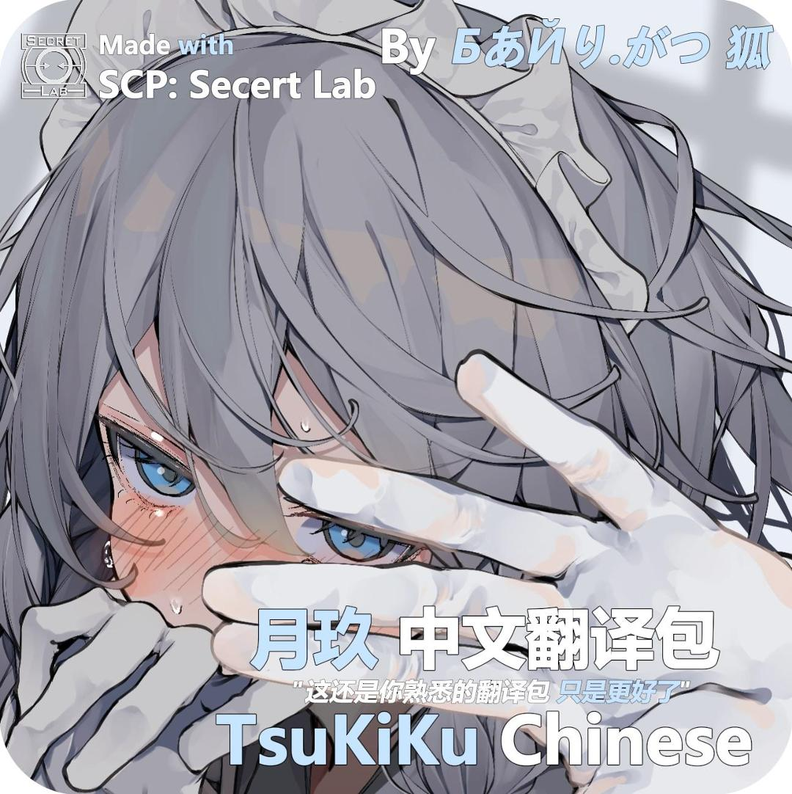
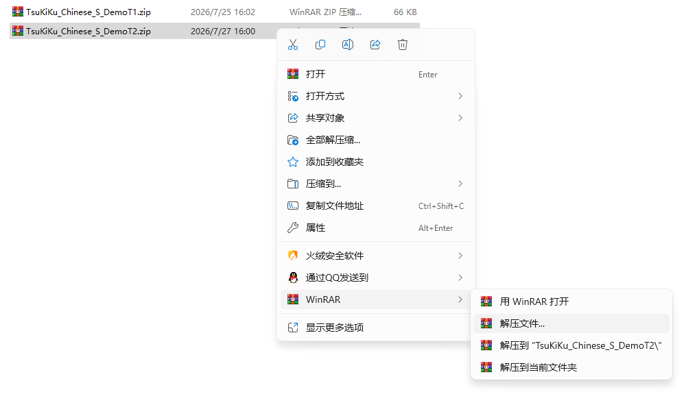
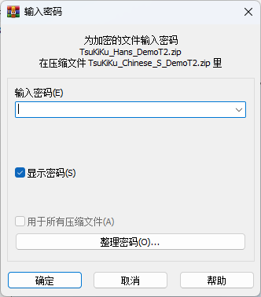
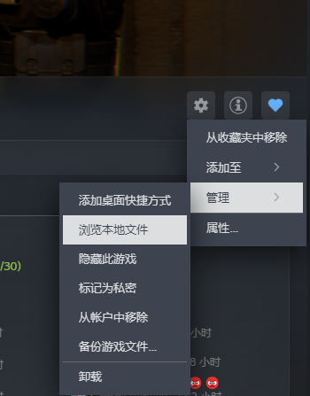
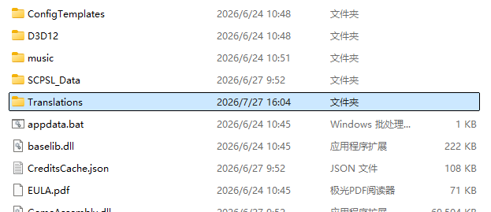
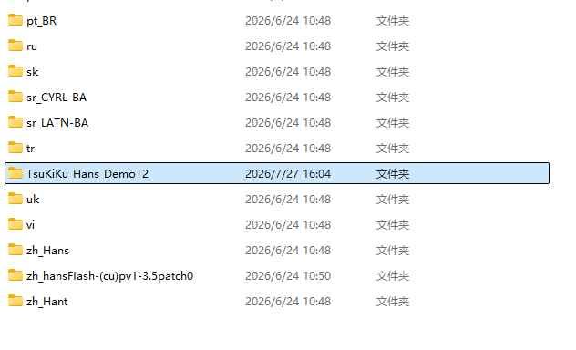
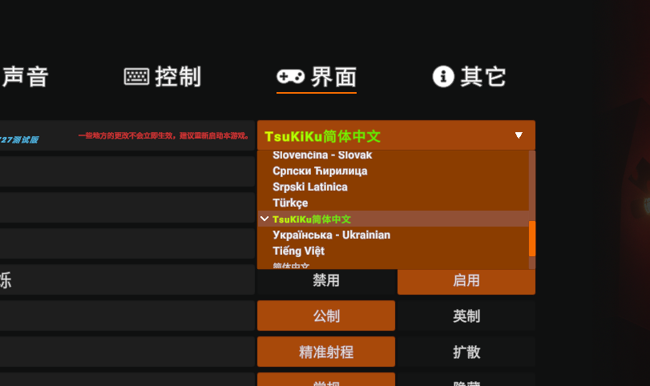

  

<h1 align="center">TsuKiKu</h1>

 

  

 <h3 align="center">Made With SCP: Secret Laboratory</h3>
 <h1 align="center">By БあЙり.がつ 狐 ✨</h1>

 <h3 align="center">📱 Social Media 📱</h3>
 

  

# Supports ZH EN ✨

 
<b>简 体 中 文 (ZH)</b>

# ⚠️ 使用前须知 ⚠️

本翻译包前身为 "zh_Hans-FLASH 系列翻译包" ，该系列翻译包最初基于 BiliBili 的 UP 主 @是闪闪闪闪闪 所创作的 "zh_HansFlashDemo 系列翻译包" 14.0 版本以前的文本改进，且已经过 UP 主的许可。 "zh_Hans-FLASH 系列翻译包" 与 秋叶社区 曾有合作关系，社区解散后停止与本人更新该系列，后于本人重新制作新版翻译包。此系列翻译包已与其无关系。

[了解详细说明](https://github.com/BaiRiGaTsuFox/TsuKiKu_Chinese_Translations_by_Bairigatsufox/tree/main?tab=License-1-ov-file)

 

## 📖 如何实装？ 📖

1️⃣ 压缩包下载完毕后将其使用 WinRAR 或 7zip 解压

 

2️⃣ 在 README.txt 文件中复制密码并解压

 

3️⃣ 打开您的 Steam ，找到 《SCP 秘密实验室》 ，然后依次点开右侧齿轮 -> 管理 -> 浏览本地文件

 

4️⃣ 找到 Translations 文件夹

 

5️⃣ 将解压完毕后的文件夹拖入该目录中

 

6️⃣ 打开游戏，在游戏设置 -> 界面 -> 界面语言中选中 月玖 简体中文并重启游戏即可

## 🎯 演示 🎯

> _仅截取部分演示，实机画面请安装后体验_

 

--> 主界面演示 

   

    
    
   

 

--> 出生时演示 

   

    
    
   

  

    
    
   

  

   --> 重生时演示

  

    
    
   

  

    
    
   

  

   --> 广播演示

  

    
    
   

  

    
    
   

   

    
    
   

 

   --> 介绍优化 

  

    
    
   

  

    
    
   

  

    
    
   

    

   --> 部分 SCP 的 GUI 改进视觉体验

   > _注意！该优化参考了部分翻译包_

  

    
    
   

  

    
    
   

 

## 🛜 中国大陆用户网络问题 🛜
如果您很难或无法访问 GitHub ，目前有两种方法可以获取压缩包

1️⃣ 加入我们的 QQ 交流群 **683919025** ，许可为 **20260725** 

2️⃣ 使用加速器或相关 **VPN** 软件访问

 

 
<b>English (EN)</b>

# ⚠️ Pre-Use Instuctions ⚠️

This translation pack is a successor to the "zh_Hans-FLASH series translation packs". The original series was refined based on texts from versions prior to 14.0 of the "zh_HansFlashDemo series translation packs" created by Bilibili UP @是闪闪闪闪闪, with explicit permission from the UP owner.
The "zh_Hans-FLASH series translation packs" previously collaborated with QiuYe(or Fall Leaves) Community. Updates to this series were discontinued after the community dissolved, and I later developed a new version of the translation pack independently. This current translation pack has no affiliation with the aforementioned series or the former community

[Learn more details](https://github.com/BaiRiGaTsuFox/TsuKiKu_Chinese_Translations_by_Bairigatsufox/tree/main?tab=License-1-ov-file)

 

## 📖 How To Install ? 📖

1️⃣ After downloading the compressed package, extract it using 7-Zip or WinRAR

 

2️⃣ Copy the password from README.txt and extract the files

 

3️⃣ Open your Steam, locate SCP: Secret Laboratory, then click the gear icon on the right -> Manage -> Browse Local Files in sequence

 

4️⃣ Locate the Translations folder

 

5️⃣ Drag the extracted folder into this directoy

 

6️⃣ Launch the game, go to Settings -> Interface -. Interface Language, choose TsuKiKu English, and restart the game

## 🎯 Demo 🎯

> _Demo only for partial content_

 

--> Main Interface Demo

   

    
    
   

 

--> Spawn Demo

   

    
    
   

  

    
    
   

  

   --> Respawn Demo

  

    
    
   

  

    
    
   

  

   --> Broadcast Demo

  

    
    
   

  

    
    
   

   

    
    
   

 

   --> Introduction Optimization
  

    
    
   

  

    
    
   

  

    
    
   

    

   --> Visual Improvements

  

    
    
   

  

    
    
   

 

-------------------------------------------------------------

 

<h3 align="center">Thanks for your support! <3 </h3>
<h3 align="center">感谢你的支持! <3 </h3>

 

 <h3 align="center">БあЙり.がつ 狐</h3>
 <h3 align="center">2133351392</h3>

 _27 Aug 2026_

